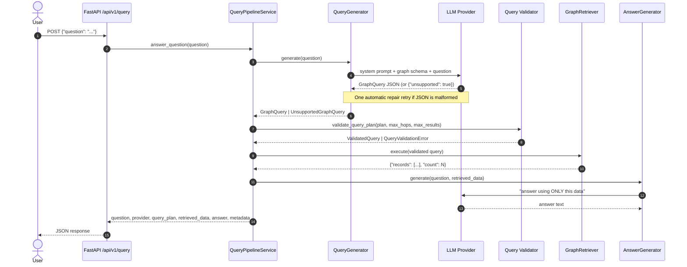
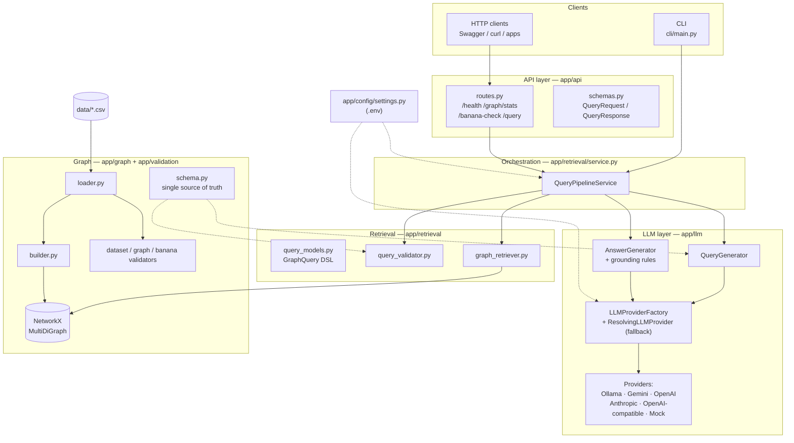
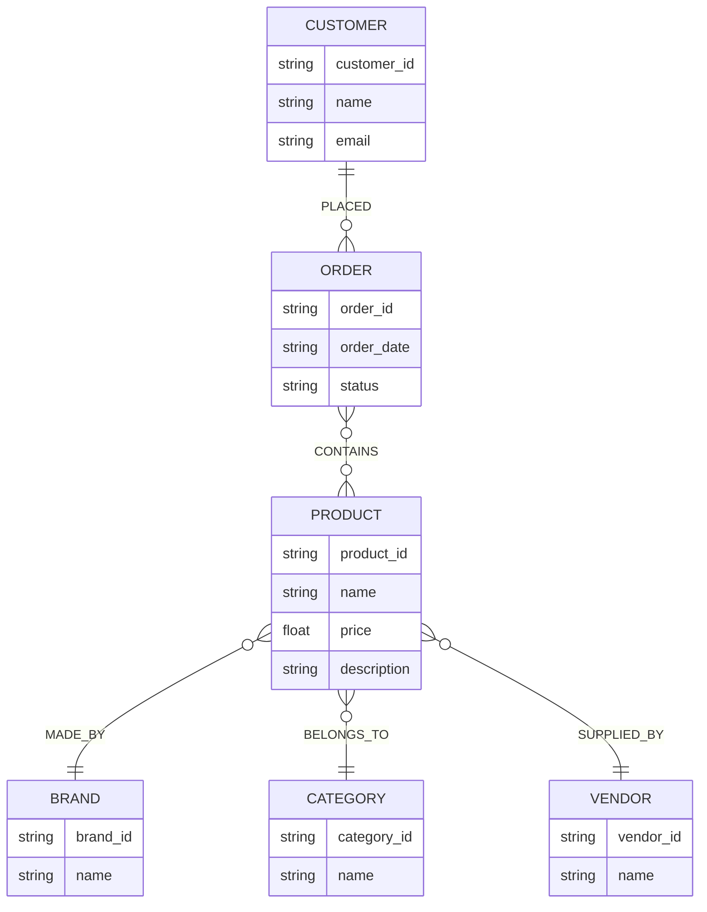
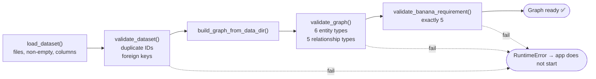
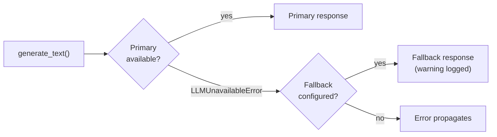
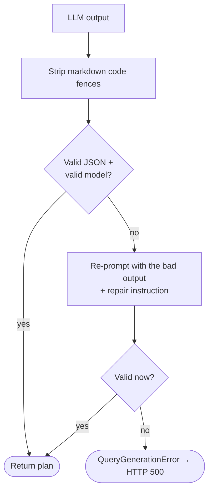

<div align="center">

# 🧠 GraphMind AI

### E-Commerce Knowledge Graph Question Answering — with an LLM that *plans* but never *executes*


-blue)


*Ask questions in plain English. Get answers that are grounded in your graph — or an honest "not available".*

</div>

---

## 📑 Table of Contents

1. [Overview](#-overview)
2. [Key Features](#-key-features)
3. [Quick Start (60 seconds, no API key)](#-quick-start-60-seconds-no-api-key)
4. [How It Works](#-how-it-works)
5. [System Architecture](#-system-architecture)
6. [Tech Stack](#-tech-stack)
7. [Project Structure](#-project-structure)
8. [The Knowledge Graph](#-the-knowledge-graph)
9. [The Query DSL (`GraphQuery`)](#-the-query-dsl-graphquery)
10. [The LLM Layer](#-the-llm-layer)
11. [REST API Reference](#-rest-api-reference)
12. [Command-Line Interface](#-command-line-interface)
13. [Configuration](#-configuration)
14. [Installation & Running (Detailed)](#-installation--running-detailed)
15. [Testing](#-testing)
16. [Utility Scripts](#-utility-scripts)
17. [Safety & Security Design](#-safety--security-design)
18. [Extending the Project](#-extending-the-project)
19. [Troubleshooting](#-troubleshooting)
20. [Known Issues & Limitations](#-known-issues--limitations)
21. [Roadmap](#-roadmap)
22. [Contributing](#-contributing)
23. [Author](#-author)

---

## 🔭 Overview

**GraphMind AI** (internally named *E-Commerce Knowledge Graph AI*) is a FastAPI service and CLI that answers natural-language questions about an e-commerce catalogue — products, brands, categories, vendors, customers, orders — by combining a **Knowledge Graph** with a **Large Language Model (LLM)**.

### The problem it solves

Asking an LLM directly about your data has two classic failure modes:

| Failure mode | What goes wrong |
|---|---|
| **Hallucination** | The model invents a vendor address, a product, or a count that is not in your data. |
| **Unsafe text-to-query** | If the model writes raw Cypher / SQL / Python, a bad or manipulated output can read or modify things it should not. |

### The approach

GraphMind splits the work into three strictly separated roles:

```
   LLM  →  PLANS      (translates the question into a small JSON query)
   Code →  VALIDATES  (checks the JSON against the graph schema and safety limits)
   Code →  EXECUTES   (runs the validated plan on an in-memory NetworkX graph)
   LLM  →  EXPLAINS   (writes the answer using ONLY the retrieved records)
```

The LLM never touches the graph and never writes executable code. It only produces a **declarative, read-only query plan** (`GraphQuery`) that must pass schema validation before anything runs. If the data is missing, the system says so instead of guessing.

---

## ✨ Key Features

- 🗺️ **In-memory Knowledge Graph** built from 7 CSV files into a NetworkX `MultiDiGraph` (6 entity types, 5 relationship types).
- 🛡️ **Safe query DSL** — only `match` and `count`; only whitelisted entities, relationships, properties and operators; hop and result limits enforced.
- 🔌 **Pluggable LLM providers** — Ollama (local), Google Gemini, OpenAI, Anthropic Claude, any OpenAI-compatible endpoint, and a deterministic **mock** provider for offline use and tests.
- 🔁 **Automatic fallback** — configure a secondary provider that is used when the primary is unreachable.
- 🩹 **Self-repair** — if the LLM returns malformed JSON, the system asks it once to correct itself.
- 🎯 **Grounded answers** — answer prompts forbid outside knowledge; hard-coded grounding rules return *"not available in the Knowledge Graph"* for unknown facts (e.g. vendor headquarters).
- ✅ **Three-stage startup validation** — dataset integrity → graph structure → "exactly 5 bananas" requirement. The app refuses to start on bad data.
- 🌐 **REST API** (`/api/v1/*`) with automatic OpenAPI docs, plus an **interactive CLI**.
- 🧪 **36 pytest tests** covering dataset, graph, DSL models, validator, retriever, providers, grounding, pipeline and API.
- 🧰 **Verification & documentation scripts** for submission checks and sample-query generation.

---

## ⚡ Quick Start (60 seconds, no API key)

The default provider is `mock`, so you can run everything offline.

```bash
git clone https://github.com/010Ankushsharma/GraphMind-AI.git
cd GraphMind-AI

python -m venv .venv
# Windows (PowerShell):  .venv\Scripts\Activate.ps1
# macOS / Linux:         source .venv/bin/activate

pip install -r requirements.txt
python run.py
```

Open **http://localhost:8000/docs** for the interactive Swagger UI, or try:

```bash
curl -X POST http://localhost:8000/api/v1/query \
  -H "Content-Type: application/json" \
  -d '{"question": "How many banana products are present in the knowledge graph?"}'
```

Expected answer: `"There are 5 banana products in the knowledge graph."`

Prefer a terminal chat? Run `python cli/main.py`.

> ℹ️ **Mock mode only understands 8 pre-defined questions** (listed in [The LLM Layer](#-the-llm-layer)). For free-form questions, configure a real provider — see [Configuration](#-configuration).

---

## 🔬 How It Works

### End-to-end request flow



### Step by step

| # | Stage | Component | What happens |
|---|---|---|---|
| 1 | **Receive** | `app/api/routes.py` | `POST /api/v1/query` accepts `{"question": "..."}`. Empty strings are rejected with HTTP 422. |
| 2 | **Plan** | `app/llm/query_generator.py` | Builds a prompt containing the *live* graph schema (generated from `schema.py`) and the question. The LLM must return only a `GraphQuery` JSON object, or `{"unsupported": true, "reason": "..."}`. Markdown fences are stripped. If parsing fails, one repair attempt is made. |
| 3 | **Short-circuit** | `app/retrieval/service.py` | If the plan is `unsupported`, the pipeline returns immediately with the reason as the answer — no retrieval, no second LLM call. |
| 4 | **Validate** | `app/retrieval/query_validator.py` | Checks operation, entities, relationship directions, properties, return fields, hop count and limit. A failure returns an `"Invalid query plan: ..."` answer instead of crashing. |
| 5 | **Execute** | `app/retrieval/graph_retriever.py` | Runs the plan on the NetworkX graph: select source nodes → apply filters → follow each relationship hop → `count` or collect records. |
| 6 | **Ground** | `app/llm/answer_generator.py` | Deterministic rules run *before* the LLM (e.g. questions about "headquarters"/"address" with no such field, or empty results, return the standard *not available* message). |
| 7 | **Explain** | `app/llm/answer_generator.py` | Otherwise the LLM writes a concise answer from the retrieved JSON only. |
| 8 | **Respond** | `app/api/schemas.py` | Returns the question, provider used, the query plan, raw retrieved data, the answer and metadata — so every answer is **auditable**. |

---

## 🏛️ System Architecture



### Design principles

1. **Single source of truth for the schema.** `app/graph/schema.py` defines entities, relationships, properties, operations and operators. The *same* definitions are used to (a) validate plans and (b) generate the schema section of the LLM prompt — so prompt and validator can never drift apart.
2. **The LLM is an untrusted component.** Its output is parsed, schema-validated and size-limited before use.
3. **Fail fast at startup, fail gracefully at request time.** Bad data stops the app from booting; bad plans produce explanatory answers, not stack traces.
4. **Everything is swappable.** Providers implement one small abstract interface (`BaseLLMProvider`); the graph backend sits behind the retriever.
5. **Auditable by default.** Every response includes the plan and the evidence used to produce the answer.

### Dependency wiring (`app/bootstrap.py`)

| Function | Cached | Purpose |
|---|---|---|
| `get_graph()` | `@lru_cache` | Loads CSVs → validates dataset → builds graph → validates graph → validates banana rule. Raises `RuntimeError` on any failure. |
| `get_llm_provider()` | `@lru_cache` | Creates the configured provider (with optional fallback wrapper). |
| `get_pipeline()` | no (cheap) | Builds a `QueryPipelineService` from the cached graph, provider and settings. |
| `configure_logging()` | – | Sets log level/format from `LOG_LEVEL`. |

The FastAPI `lifespan` hook configures logging and calls `get_graph()` at startup, so the graph is loaded and validated **once** before the first request.

---

## 🧰 Tech Stack

| Layer | Technology | Role |
|---|---|---|
| Web framework | **FastAPI** ≥ 0.115, **Uvicorn[standard]** ≥ 0.32 | REST API, OpenAPI docs, ASGI server |
| Validation & settings | **Pydantic** ≥ 2.9, **pydantic-settings** ≥ 2.6, **python-dotenv** | Query DSL models, `.env` configuration |
| Graph | **NetworkX** ≥ 3.2 | In-memory `MultiDiGraph` |
| HTTP client | **httpx** ≥ 0.27 | Talking to a local Ollama server |
| LLM SDKs *(optional, import-guarded)* | **google-genai** ≥ 1.0, **openai** ≥ 1.55, **anthropic** ≥ 0.39 | Gemini, OpenAI / OpenAI-compatible, Claude |
| Testing | **pytest** ≥ 8.3, **pytest-asyncio** ≥ 0.24 | Test suite |
| Data | Plain **CSV** files | Source dataset |

> The three LLM SDKs are imported **lazily inside each provider**, so a missing SDK only affects that provider (it raises `LLMUnavailableError` with a clear message), not the whole app.


---

## 📂 Project Structure

```
GraphMind-AI/
├── app/                              # Main application package (v1.0.0)
│   ├── __init__.py                   # Package marker + __version__
│   ├── main.py                       # FastAPI app + startup lifespan
│   ├── bootstrap.py                  # Dependency wiring, cached graph & provider, logging
│   ├── api/
│   │   ├── __init__.py
│   │   ├── routes.py                 # /api/v1 endpoints
│   │   └── schemas.py                # QueryRequest / QueryResponse models
│   ├── config/
│   │   ├── __init__.py
│   │   └── settings.py               # Pydantic Settings (env / .env)
│   ├── graph/
│   │   ├── __init__.py
│   │   ├── loader.py                 # CSV loading + file/column checks
│   │   ├── models.py                 # DatasetBundle dataclass + node_key()
│   │   ├── builder.py                # CSV rows → NetworkX MultiDiGraph
│   │   ├── schema.py                 # Entities, relationships, properties, operators
│   │   └── stats.py                  # Graph statistics
│   ├── llm/
│   │   ├── __init__.py
│   │   ├── base.py                   # BaseLLMProvider, LLMResponse, errors
│   │   ├── factory.py                # LLMProviderFactory + ResolvingLLMProvider
│   │   ├── prompts.py                # System prompts + schema prompt builder
│   │   ├── query_generator.py        # Question → GraphQuery (with repair retry)
│   │   ├── answer_generator.py       # Retrieved data → grounded answer
│   │   ├── ollama_provider.py        # Local Ollama (httpx)
│   │   ├── gemini_provider.py        # Google Gemini (google-genai)
│   │   ├── openai_provider.py        # OpenAI
│   │   ├── anthropic_provider.py     # Anthropic Claude
│   │   ├── openai_compatible_provider.py  # Any OpenAI-compatible server
│   │   └── mock_provider.py          # Deterministic offline provider
│   ├── retrieval/
│   │   ├── __init__.py
│   │   ├── query_models.py           # GraphQuery DSL (Pydantic)
│   │   ├── query_validator.py        # Schema + safety validation
│   │   ├── graph_retriever.py        # Executes plans on the graph
│   │   └── service.py                # QueryPipelineService (orchestrator)
│   └── validation/
│       ├── __init__.py
│       ├── dataset_validator.py      # Duplicate IDs + referential integrity
│       ├── graph_validator.py        # Required entity / relationship types
│       └── banana_validator.py       # "Exactly 5 bananas" requirement
├── cli/
│   └── main.py                       # Interactive terminal Q&A
├── data/                             # Source dataset (7 CSV files)
│   ├── products.csv   brands.csv   categories.csv   vendors.csv
│   └── customers.csv  orders.csv   order_items.csv
├── scripts/
│   ├── verify_submission.py          # PASS/FAIL validation report
│   └── generate_sample_queries.py    # Writes docs/sample_queries.md
├── tests/                            # 11 test modules + conftest (36 tests)
├── run.py                            # Uvicorn launcher (0.0.0.0:8000)
├── requirements.txt
├── pytest.ini
├── .env.example                      # Configuration template
└── .gitignore
```

### File-by-file reference

#### Entry points

| File | Description |
|---|---|
| `run.py` | Starts Uvicorn on `0.0.0.0:8000` serving `app.main:app` with `reload=False`. |
| `app/main.py` | Creates the `FastAPI` app (title *E-Commerce Knowledge Graph AI*, v1.0.0), registers the router, and defines the `lifespan` that configures logging and eagerly loads the graph. |
| `cli/main.py` | Interactive loop: reads a question, runs the same pipeline as the API, and prints provider, query plan, retrieved data and final answer. Exit with `exit`, `quit`, `Ctrl+C` or `Ctrl+D`. |

#### `app/config`

| File | Description |
|---|---|
| `settings.py` | `Settings(BaseSettings)` reads environment variables and `.env` (UTF-8, unknown keys ignored). Each field has an explicit alias (e.g. `LLM_PROVIDER`). Exposes `data_path`, resolved relative to the project root. `get_settings()` is `@lru_cache`d. |

#### `app/graph`

| File | Description |
|---|---|
| `loader.py` | Verifies that each of the 7 required CSVs exists, is non-empty, and contains the required columns, then reads them into a `DatasetBundle`. Raises `FileNotFoundError` / `ValueError` with precise messages. |
| `models.py` | Frozen `DatasetBundle` dataclass (lists of row dicts) and `node_key(type, id)` → `"Type:ID"`. |
| `builder.py` | Creates nodes with typed attributes and edges with a `relationship` attribute. Defines the relationship constants `MADE_BY`, `BELONGS_TO`, `SUPPLIED_BY`, `PLACED`, `CONTAINS`. |
| `schema.py` | Declarative schema: `ENTITY_TYPES`, `RELATIONSHIPS`, `RELATIONSHIP_SCHEMA`, `INVERSE_RELATIONSHIPS`, `ENTITY_PROPERTIES`, `ALLOWED_OPERATIONS`, `ALLOWED_OPERATORS`. |
| `stats.py` | `count_entities()` and `graph_statistics()` used by `/graph/stats`. |

#### `app/retrieval`

| File | Description |
|---|---|
| `query_models.py` | Pydantic models: `GraphFilter`, `GraphRelationshipTraversal`, `GraphQuery`, `UnsupportedGraphQuery`. |
| `query_validator.py` | `validate_query_plan()` + `QueryValidationError`. |
| `graph_retriever.py` | `GraphRetriever.execute()` — filter, traverse, count/collect. |
| `service.py` | `QueryPipelineService.answer_question()` — the orchestrator described in [How It Works](#-how-it-works). |

#### `app/llm`

| File | Description |
|---|---|
| `base.py` | `BaseLLMProvider` (abstract: `name`, `generate_text()`, optional `health_check()`), `LLMResponse`, `LLMProviderError`, `LLMUnavailableError`. |
| `factory.py` | `LLMProviderFactory.create()`, `ResolvingLLMProvider` (primary + fallback), and `_build_single()`. |
| `prompts.py` | `QUERY_GENERATION_SYSTEM`, `build_query_schema_prompt()`, `QUERY_REPAIR_USER`, `ANSWER_GENERATION_SYSTEM`. |
| `query_generator.py` | Calls the LLM, strips code fences, parses JSON into `GraphQuery`/`UnsupportedGraphQuery`, retries once on malformed output, else raises `QueryGenerationError`. |
| `answer_generator.py` | Applies deterministic grounding rules, then asks the LLM for a final answer using only the retrieved data. |
| `*_provider.py` | One adapter per backend (see [The LLM Layer](#-the-llm-layer)). |

#### `app/validation`

| File | Description |
|---|---|
| `dataset_validator.py` | Detects duplicate IDs in all 7 tables and broken foreign keys (product→brand/category/vendor, order→customer, order item→order/product). |
| `graph_validator.py` | Ensures all 6 entity types and all 5 relationship types exist in the built graph. |
| `banana_validator.py` | Counts `Product` nodes whose name (trimmed, case-insensitive) equals `banana`; PASS only when the count is exactly **5**. |

---

## 🕸️ The Knowledge Graph

### Dataset (`data/`)

| File | Columns | Rows | Notes |
|---|---|---:|---|
| `products.csv` | `product_id, name, price, description, brand_id, category_id, vendor_id` | 35 | 30 regular (`P001`–`P030`) + 5 bananas (`P-BANANA-001`…`005`) |
| `brands.csv` | `brand_id, name` | 8 | Nike, Adidas, Apple, Samsung, Sony, Dell, Lenovo, FreshFarm |
| `categories.csv` | `category_id, name` | 7 | Shoes, Smartphones, Laptops, Headphones, Accessories, Home Electronics, Produce |
| `vendors.csv` | `vendor_id, name` | 6 | Vendor A – Vendor F (`V001`–`V006`) |
| `customers.csv` | `customer_id, name, email` | 20 | `C001`–`C020` (Rahul, Priya, Aman, …) |
| `orders.csv` | `order_id, customer_id, order_date, status` | 40 | `O1001`–`O1040`, dates 2025-01-05 → 2025-04-01; statuses: 33 completed, 4 shipped, 3 pending |
| `order_items.csv` | `order_item_id, order_id, product_id, quantity, unit_price` | 65 | Line items linking orders to products |

> To use your own data, keep the same file names and columns (or adapt `loader.py` / `builder.py`) and point `DATA_DIR` at the folder.

### Graph model



**Relationships (directed)**

| Relationship | From → To | Edge attributes |
|---|---|---|
| `MADE_BY` | Product → Brand | – |
| `BELONGS_TO` | Product → Category | – |
| `SUPPLIED_BY` | Product → Vendor | – |
| `PLACED` | Customer → Order | – |
| `CONTAINS` | Order → Product | `quantity` (int), `unit_price` (float) |

### Implementation details

- **Graph type:** `networkx.MultiDiGraph` (directed, parallel edges allowed).
- **Node IDs:** namespaced as `"<EntityType>:<id>"`, e.g. `Product:P001`, `Customer:C001`. This avoids collisions — note that `Customer` and `Category` IDs both start with `C001…`, but the keys `Customer:C001` and `Category:C001` are distinct.
- **Node attributes:** every node carries `entity_type` plus its CSV fields (`price` is converted to `float`).
- **Edge attributes:** every edge has `relationship`; `CONTAINS` edges additionally store `quantity` and `unit_price`.
- **Size of the bundled dataset:** **116 nodes** (35 products + 8 brands + 7 categories + 6 vendors + 20 customers + 40 orders) and **210 edges** (105 product edges + 40 `PLACED` + 65 `CONTAINS`).

### Startup validation chain



### The "banana" requirement

The dataset intentionally contains **exactly five** products named `banana` (brand *FreshFarm*, category *Produce*, supplied by five different vendors). This acts as a built-in correctness probe for counting: a good pipeline must answer *"How many banana products are there?"* with **5** — retrieved from the graph, not guessed. The check runs at startup, via `GET /api/v1/banana-check`, in `verify_submission.py`, and in the tests.

---

## 📐 The Query DSL (`GraphQuery`)

The LLM's only output is a JSON document in this DSL (defined in `app/retrieval/query_models.py`).

```json
{
  "operation": "match",
  "source_entity": "Customer",
  "relationships": [
    { "relationship": "PLACED",   "target_entity": "Order" },
    { "relationship": "CONTAINS", "target_entity": "Product" }
  ],
  "filters": [
    { "property": "name", "operator": "case_insensitive_equals", "value": "Rahul" }
  ],
  "return_fields": ["product_id", "name"],
  "limit": 50
}
```

### Fields

| Field | Type | Description |
|---|---|---|
| `operation` | `"match"` \| `"count"` | `match` returns records; `count` returns only a number. |
| `source_entity` | string | Entity type to start from (`Product`, `Brand`, `Category`, `Vendor`, `Order`, `Customer`). |
| `relationships` | list of hops | Ordered traversal. Each hop: `relationship`, `target_entity`, optional `target_filter`. |
| `filters` | list | Conditions applied to the **source** entity. All must match (logical AND). |
| `return_fields` | list of strings | Properties to return. Required for `match`; must belong to the **final** entity. |
| `limit` | int ≥ 1 (default 50) | Maximum records for `match`. |

A filter is `{ "property": "...", "operator": "...", "value": "..." }`.

### Operators

| Operator | Semantics |
|---|---|
| `equals` | Exact, case-sensitive string equality |
| `case_insensitive_equals` | Equality ignoring case |
| `contains` | Case-insensitive substring match |
| `starts_with` | Case-insensitive prefix match |

> Values are compared as strings. There are no numeric comparison operators yet (see [Roadmap](#-roadmap)).

### Unsupported questions

If the schema cannot express the question, the LLM returns:

```json
{ "unsupported": true, "reason": "Short explanation" }
```

The pipeline then answers with the `reason` and does not query the graph.

### Valid traversals (`RELATIONSHIP_SCHEMA`)

| From | Relationship → Target |
|---|---|
| `Product` | `MADE_BY` → `Brand`, `BELONGS_TO` → `Category`, `SUPPLIED_BY` → `Vendor` |
| `Customer` | `PLACED` → `Order` |
| `Order` | `CONTAINS` → `Product` |

Traversal follows **edge direction only**.

### Validation rules (`validate_query_plan`)

| Check | Error raised |
|---|---|
| `operation` ∈ {`match`, `count`} | `Unknown operation` |
| `source_entity` is a known entity | `Unknown entity` |
| `len(relationships) ≤ MAX_GRAPH_HOPS` (default 4) | `Too many relationship hops` |
| `limit ≤ MAX_QUERY_RESULTS` (default 50) | `Limit exceeds maximum` |
| Every filter's `property` exists on the entity it targets; operator is allowed | `Unknown property` / `Unknown operator` |
| Each hop's relationship exists, is valid from the current entity, and `target_entity` matches the schema | `Unknown relationship` / `Relationship … invalid from …` / `must target …` |
| Every `return_fields` item is a property of the **final** entity | `Invalid return field` |
| `match` has at least one return field | `match operation requires return_fields` |

On failure the pipeline does **not** raise to the client; it returns HTTP 200 with `answer: "Invalid query plan: <reason>"` and `metadata.validation_error`.

### Execution semantics (`GraphRetriever.execute`)

1. Collect all nodes of `source_entity`.
2. Keep only those satisfying every `filters` entry.
3. For each hop: follow outgoing edges whose `relationship` matches, whose target has the expected `entity_type`, and (if given) satisfies `target_filter`. The set of reached target nodes **replaces** the current node set.
4. `count` → number of distinct nodes remaining; `match` → one record per remaining node (sorted by node ID, truncated at `limit`), containing only `return_fields`.

> ⚠️ Step 3 has an important consequence for plans that put a `target_filter` on a hop — see [Known Issues](#-known-issues--limitations), issue #1.

---

## 🤖 The LLM Layer

### Provider abstraction

```python
class BaseLLMProvider(ABC):
    @property
    def name(self) -> str: ...
    def generate_text(self, system_prompt, user_prompt, structured_schema=None) -> LLMResponse: ...
    def health_check(self) -> bool: ...   # optional, default True
```

All failures are normalised to `LLMUnavailableError`, which the factory's fallback logic understands.

### Supported providers

| `LLM_PROVIDER` | Class | Backend | JSON-mode handling | Required settings |
|---|---|---|---|---|
| `mock` *(default)* | `MockLLMProvider` | none (rule-based) | n/a | – |
| `ollama` | `OllamaProvider` | Local Ollama `POST /api/chat` (non-streaming) | `format: "json"` | `OLLAMA_BASE_URL`, `OLLAMA_MODEL` |
| `gemini` | `GeminiProvider` | Google `google-genai` SDK | `response_mime_type="application/json"` | `GEMINI_API_KEY` |
| `openai` | `OpenAIProvider` | OpenAI Chat Completions | `response_format={"type":"json_object"}` | `OPENAI_API_KEY` |
| `anthropic` | `AnthropicProvider` | Anthropic Messages API (`max_tokens=2048`) | prompt-enforced JSON | `ANTHROPIC_API_KEY` |
| `openai_compatible` | `OpenAICompatibleProvider` | Any server speaking the OpenAI API (LM Studio, vLLM, LocalAI, …) | `json_object` | `OPENAI_COMPATIBLE_BASE_URL`, `OPENAI_COMPATIBLE_MODEL` (key optional) |
| `auto` | – | Currently resolves to **`ollama`** | – | – |

Provider-specific behaviour worth knowing:

- **Ollama** — `health_check()` calls `GET /api/tags` (5 s timeout). Timeouts, connection errors, `404` (model not found) and HTTP ≥ 400 all become `LLMUnavailableError`.
- **Gemini** — maps `429`/quota to *"quota or rate limit exceeded"* and `401`/`403`/"API key" to *"authentication failed"*.
- **OpenAI / Anthropic** — map auth errors to a clear *"authentication failed"* message.
- **Empty responses** are treated as failures for every provider.

### Fallback strategy



Set `LLM_FALLBACK_PROVIDER` (e.g. primary `ollama`, fallback `gemini`) to enable it. When the primary is Ollama, a health check runs before each call. The wrapper is only created if the fallback differs from the primary; `ResolvingLLMProvider.name` reports whichever provider **last answered**, and that name appears in the API response's `provider` field.

### Prompts (`app/llm/prompts.py`)

| Prompt | Purpose | Key rules |
|---|---|---|
| `QUERY_GENERATION_SYSTEM` | Query planner | Use only the provided schema; no invented entities/relationships/properties; no Python/Cypher; do not answer the question; read-only (`match`/`count`); return JSON only, no markdown fences; return `{"unsupported": true, ...}` when inexpressible. |
| `build_query_schema_prompt()` | Schema injection | Generated at runtime from `schema.py`: entities + properties, relationship directions, allowed operations and operators, JSON shape. |
| `QUERY_REPAIR_USER` | Self-repair | Sent with the previous bad output when parsing fails. |
| `ANSWER_GENERATION_SYSTEM` | Answer writer | Use only retrieved data; no outside knowledge, guessing, inference or invented values; say the information is unavailable when data is empty/insufficient; be concise. |

### Query generation with repair



### Grounding rules (`AnswerGenerator`)

Applied **before** any LLM call, so the answer is deterministic in these cases:

| Condition | Result |
|---|---|
| Question mentions *headquarters* or *address* and no returned record has `headquarters` / `address` / `hq_address` | `"The requested information is not available in the Knowledge Graph."` |
| No records **and** `count == 0`, and the question contains `how many`, `which`, `what`, `who`, `list` or `show` | Same *not available* message |
| Anything else | The LLM writes the answer from the retrieved JSON |

### Mock provider

`MockLLMProvider` is a deterministic, offline stand-in for development, CI and demos. It matches the (normalised, lower-cased) question against 8 patterns and returns a fixed query plan; for answers it produces simple templated text. Anything else yields an `unsupported` plan.

| # | Question (substring matched) | Intended result |
|---|---|---|
| 1 | "…products are made by Nike" | Products by brand Nike — ⚠️ see Known Issue #1 |
| 2 | "…products from Nike are supplied by Vendor A" | `P001`, `P002`, `P019` — ⚠️ see Known Issue #1 |
| 3 | "…products are supplied by Vendor B" | Products supplied by Vendor B — ⚠️ see Known Issue #1 |
| 4 | "…category does iPhone 17 belong…" | `Smartphones` ✅ |
| 5 | "…products did Rahul order" | 7 distinct products ✅ |
| 6 | "How many orders has Rahul placed" | `3` → *"Rahul has placed 3 orders."* ✅ |
| 7 | "How many banana products…" | `5` → *"There are 5 banana products in the knowledge graph."* ✅ |
| 8 | "…headquarters address of Vendor A" | *Not available in the Knowledge Graph* ✅ |

---

## 🌐 REST API Reference

**Base URL:** `http://localhost:8000` · **Prefix:** `/api/v1` · **Interactive docs:** `/docs` (Swagger) and `/redoc`

| Method | Path | Purpose |
|---|---|---|
| `GET` | `/api/v1/health` | Liveness + graph + LLM reachability |
| `GET` | `/api/v1/graph/stats` | Entity, node, relationship and banana counts |
| `GET` | `/api/v1/banana-check` | Run the banana validator and list matches |
| `POST` | `/api/v1/query` | Ask a natural-language question |

### `GET /api/v1/health`

```json
{
  "status": "ok",
  "graph_loaded": true,
  "llm_provider": "mock",
  "llm_reachable": true
}
```

- `status` is `"ok"` when the graph loads, otherwise `"degraded"`.
- `llm_reachable` is a real reachability probe **only for Ollama** (`GET /api/tags`). For other providers it is always `true` (no network call is made).

### `GET /api/v1/graph/stats`

```json
{
  "products": 35,
  "brands": 8,
  "categories": 7,
  "vendors": 6,
  "customers": 20,
  "orders": 40,
  "nodes": 116,
  "relationships": 210,
  "banana_count": 5
}
```

### `GET /api/v1/banana-check`

```json
{
  "expected": 5,
  "actual": 5,
  "status": "PASS",
  "matching_nodes": [
    { "node_id": "Product:P-BANANA-001", "product_id": "P-BANANA-001", "name": "banana" },
    { "node_id": "Product:P-BANANA-002", "product_id": "P-BANANA-002", "name": "banana" }
  ]
}
```
*(list shortened — the real response contains all five matches)*

### `POST /api/v1/query`

**Request body**

| Field | Type | Rules |
|---|---|---|
| `question` | string | Required, minimum length 1 |

**Response body**

| Field | Type | Description |
|---|---|---|
| `question` | string | Echo of the input |
| `provider` | string | Provider that produced the result (`mock`, `ollama`, `gemini`, …) |
| `query_plan` | object | The `GraphQuery` (or `{"unsupported": true, "reason": …}`) |
| `retrieved_data` | object | `{"records": [...], "count": N}` — the evidence |
| `answer` | string | Final natural-language answer |
| `metadata` | object | `retrieval_count`, and `unsupported` / `validation_error` when relevant |

#### Example 1 — counting

```bash
curl -X POST http://localhost:8000/api/v1/query \
  -H "Content-Type: application/json" \
  -d '{"question": "How many banana products are present in the knowledge graph?"}'
```

```json
{
  "question": "How many banana products are present in the knowledge graph?",
  "provider": "mock",
  "query_plan": {
    "operation": "count",
    "source_entity": "Product",
    "relationships": [],
    "filters": [
      { "property": "name", "operator": "case_insensitive_equals", "value": "banana" }
    ],
    "return_fields": [],
    "limit": 50
  },
  "retrieved_data": { "records": [], "count": 5 },
  "answer": "There are 5 banana products in the knowledge graph.",
  "metadata": { "retrieval_count": 5 }
}
```

#### Example 2 — multi-hop traversal count

*"How many orders has Rahul placed?"* → plan: `Customer(name=Rahul) —PLACED→ Order`, operation `count`.

```json
{
  "provider": "mock",
  "retrieved_data": { "records": [], "count": 3 },
  "answer": "Rahul has placed 3 orders.",
  "metadata": { "retrieval_count": 3 }
}
```
*(`query_plan` omitted for brevity)*

#### Example 3 — missing information is not hallucinated

*"What is the headquarters address of Vendor A?"* — the graph has no address field, so the grounding rule answers deterministically:

```json
{
  "provider": "mock",
  "retrieved_data": {
    "records": [ { "vendor_id": "V001", "name": "Vendor A" } ],
    "count": 1
  },
  "answer": "The requested information is not available in the Knowledge Graph.",
  "metadata": { "retrieval_count": 1 }
}
```

#### Example 4 — unsupported question

```json
{
  "provider": "mock",
  "query_plan": {
    "unsupported": true,
    "reason": "Question cannot be mapped to the graph schema in mock mode."
  },
  "retrieved_data": { "records": [], "count": 0 },
  "answer": "Question cannot be mapped to the graph schema in mock mode.",
  "metadata": { "unsupported": true, "retrieval_count": 0 }
}
```

### Error handling

| Situation | HTTP | Body |
|---|---|---|
| Empty / missing `question` | `422` | Standard FastAPI validation error |
| LLM unreachable, auth failure, empty response, or unparseable plan after repair | `500` | `{"detail": "<message>"}` |
| Plan fails schema validation | `200` | `answer` = `"Invalid query plan: …"`, `metadata.validation_error` set |
| Unsupported question | `200` | `answer` = the reason, `metadata.unsupported = true` |
| Provider cannot be constructed (e.g. missing API key) | `500` on `/health`; `500` with `detail` on `/query` | – |

> The API is **synchronous** (plain `def` endpoints), so FastAPI runs each request in its thread pool.

---

## 💻 Command-Line Interface

```bash
python cli/main.py
```

```
E-Commerce Knowledge Graph AI
--------------------------------
Type a question (or 'exit'):
> How many orders has Rahul placed?

Provider: mock

Query Plan:
{ ...JSON... }

Retrieved Data:
{ "records": [], "count": 3 }

Final Answer:
Rahul has placed 3 orders.
--------------------------------
>
```

The CLI adds the project root to `sys.path`, so it can be launched from any directory. It uses the same provider configuration as the API (`.env`). Type `exit` or `quit` (or press `Ctrl+C` / `Ctrl+D`) to leave.

---

## ⚙️ Configuration

All settings are read from environment variables, or from a `.env` file in the working directory. Copy the template to get started:

```bash
cp .env.example .env        # Windows PowerShell: Copy-Item .env.example .env
```

### Environment variables

| Variable | Default | Description |
|---|---|---|
| `APP_NAME` | `Ecommerce Knowledge Graph AI` | Display name |
| `APP_ENV` | `development` | Environment label |
| `LOG_LEVEL` | `INFO` | Python log level (`DEBUG`, `INFO`, `WARNING`, …) |
| `LLM_PROVIDER` | `mock` | `mock` · `ollama` · `gemini` · `openai` · `anthropic` · `openai_compatible` · `auto` |
| `LLM_FALLBACK_PROVIDER` | *(empty)* | Optional secondary provider used when the primary is unavailable |
| `OLLAMA_BASE_URL` | `http://localhost:11434` | Ollama server URL |
| `OLLAMA_MODEL` | `llama3.2` | Ollama model name |
| `OLLAMA_TIMEOUT_SECONDS` | `120` | Request timeout |
| `GEMINI_API_KEY` | *(empty)* | Google AI API key |
| `GEMINI_MODEL` | `gemini-2.5-flash-lite` | Gemini model |
| `OPENAI_API_KEY` | *(empty)* | OpenAI API key |
| `OPENAI_MODEL` | `gpt-4o-mini` | OpenAI model |
| `ANTHROPIC_API_KEY` | *(empty)* | Anthropic API key |
| `ANTHROPIC_MODEL` | `claude-3-5-haiku-latest` | Claude model |
| `OPENAI_COMPATIBLE_BASE_URL` | *(empty)* | e.g. `http://localhost:1234/v1` |
| `OPENAI_COMPATIBLE_API_KEY` | *(empty)* | Optional; `"not-needed"` is sent if empty |
| `OPENAI_COMPATIBLE_MODEL` | *(empty)* | Model identifier on that server |
| `MAX_GRAPH_HOPS` | `4` | Maximum relationship hops per query plan |
| `MAX_QUERY_RESULTS` | `50` | Maximum `limit` a plan may request |
| `DATA_DIR` | `data` | Dataset folder, relative to the project root |

> 🔐 **Never commit `.env`** — it is already listed in `.gitignore`. Model names are provider-controlled and may be retired over time; if a request fails with "model not found", update the corresponding `*_MODEL` variable.

### Provider recipes

<details>
<summary><b>Mock</b> (default — offline, no setup)</summary>

```env
LLM_PROVIDER=mock
```
</details>

<details>
<summary><b>Ollama</b> (free, local)</summary>

```bash
ollama pull llama3.2
ollama serve            # if not already running
```
```env
LLM_PROVIDER=ollama
OLLAMA_BASE_URL=http://localhost:11434
OLLAMA_MODEL=llama3.2
```
</details>

<details>
<summary><b>Google Gemini</b></summary>

```env
LLM_PROVIDER=gemini
GEMINI_API_KEY=your-key
GEMINI_MODEL=gemini-2.5-flash-lite
```
</details>

<details>
<summary><b>OpenAI</b></summary>

```env
LLM_PROVIDER=openai
OPENAI_API_KEY=sk-...
OPENAI_MODEL=gpt-4o-mini
```
</details>

<details>
<summary><b>Anthropic Claude</b></summary>

```env
LLM_PROVIDER=anthropic
ANTHROPIC_API_KEY=your-key
ANTHROPIC_MODEL=claude-3-5-haiku-latest
```
</details>

<details>
<summary><b>OpenAI-compatible server</b> (LM Studio, vLLM, LocalAI, …)</summary>

```env
LLM_PROVIDER=openai_compatible
OPENAI_COMPATIBLE_BASE_URL=http://localhost:1234/v1
OPENAI_COMPATIBLE_MODEL=your-local-model
OPENAI_COMPATIBLE_API_KEY=
```
</details>

<details>
<summary><b>Local-first with cloud fallback</b></summary>

```env
LLM_PROVIDER=ollama
LLM_FALLBACK_PROVIDER=gemini
GEMINI_API_KEY=your-key
```
If Ollama is down or the model is missing, requests transparently go to Gemini, and the response's `provider` field tells you which one answered.
</details>

---

## 🛠️ Installation & Running (Detailed)

### Prerequisites

- **Python 3.10+** (the code uses `X | None` union syntax; the project was developed on a recent Python 3.14 environment)
- `pip` and `venv`
- *Optional:* [Ollama](https://ollama.com) for local LLMs, or an API key for a cloud provider

### 1. Get the code

```bash
git clone https://github.com/010Ankushsharma/GraphMind-AI.git
cd GraphMind-AI
```

### 2. Create a virtual environment

| OS | Commands |
|---|---|
| Windows (PowerShell) | `python -m venv .venv` → `.venv\Scripts\Activate.ps1` |
| Windows (cmd) | `python -m venv .venv` → `.venv\Scripts\activate.bat` |
| macOS / Linux | `python3 -m venv .venv` → `source .venv/bin/activate` |

### 3. Install dependencies

```bash
pip install -r requirements.txt
```

### 4. Configure (optional)

```bash
cp .env.example .env
# edit .env — skip this to stay in offline mock mode
```

### 5. Verify the setup

```bash
python scripts/verify_submission.py
```

### 6. Start the server

```bash
python run.py                              # production-style, no auto-reload, binds 0.0.0.0:8000
# or, for development with auto-reload:
uvicorn app.main:app --reload --port 8000
```

You should see `Knowledge Graph built: 116 nodes, 210 edges` and `Banana validation passed` in the logs.

### 7. Use it

| Interface | How |
|---|---|
| Swagger UI | http://localhost:8000/docs |
| ReDoc | http://localhost:8000/redoc |
| CLI | `python cli/main.py` |
| curl | see [REST API Reference](#-rest-api-reference) |
| PowerShell | `Invoke-RestMethod -Method Post -Uri http://localhost:8000/api/v1/query -ContentType "application/json" -Body '{"question":"How many orders has Rahul placed?"}'` |

---

## 🧪 Testing

```bash
pytest                    # run everything (offline — uses the mock provider)
pytest -v                 # verbose
pytest tests/test_api.py  # a single module
pytest -m integration     # reserved for tests that need live LLM providers
```

`pytest.ini` sets `testpaths = tests`, `pythonpath = .`, and registers an `integration` marker for tests that would require live providers (Ollama, Gemini, etc.). `tests/conftest.py` forces `LLM_PROVIDER=mock` (unless already set) and provides session-scoped `graph` and `settings` fixtures that clear the LRU caches so each run starts clean.

### Test inventory — 36 tests

| Module | Tests | What it covers |
|---|---:|---|
| `test_api.py` | 5 | `/health`, `/graph/stats` (banana = 5, ≥ 25 products), `/banana-check`, `/query` happy path, `422` on empty question |
| `test_banana.py` | 2 | Validator reports 5 / `PASS`; retriever returns 5 banana records |
| `test_dataset.py` | 2 | Minimum row counts; referential integrity |
| `test_graph.py` | 2 | All 6 entity types present; product nodes have `product_id`, `name`, `price` |
| `test_relationships.py` | 3 | All 5 edge types present; `Product→Brand` direction; `Customer(Rahul)→Order→Product` path |
| `test_query_models.py` | 2 | Valid `GraphQuery`; invalid operation (`delete`) rejected |
| `test_query_validator.py` | 5 | Valid plan accepted; unknown entity / relationship / property and excessive hops rejected |
| `test_retriever.py` | 4 | Brand-filtered products, Nike ∩ Vendor A, banana count, empty result |
| `test_providers.py` | 7 | Factory builds each provider type; Ollama `generate_text` with mocked `httpx` |
| `test_grounding.py` | 2 | Missing vendor address is **not** hallucinated; banana count via full pipeline |
| `test_pipeline.py` | 2 | Nike ∩ Vendor A via pipeline; Rahul order count = 3 |

> ⚠️ Three tests (`test_nike_products_via_brand_filter`, `test_nike_vendor_a_intersection`, `test_pipeline_nike_vendor_a`) exercise the traversal behaviour described in [Known Issue #1](#-known-issues--limitations) and are expected to fail until that is fixed. The `.pytest_cache` shipped with the project lists exactly these three as last-failed.

---

## 🧾 Utility Scripts

### `scripts/verify_submission.py`

Runs an end-to-end health check using the mock provider and exits with code `0` (all PASS) or `1`.

```
=========================================
KNOWLEDGE GRAPH SUBMISSION VALIDATION
=========================================

Dataset ...................... PASS
Graph construction ........... PASS
Required entities ............ PASS
Relationships ................ PASS
Banana count = 5 ............. PASS
Banana retrieval ............. PASS
Query validation ............. PASS
Sample retrieval ............. PASS

OVERALL STATUS: PASS
=========================================
```

Checks: dataset integrity, graph construction, required entities and relationships, banana count (validator and retriever), query validation, and a sample retrieval.

### `scripts/generate_sample_queries.py`

Runs 8 representative questions through the mock pipeline and writes a Markdown report to **`docs/sample_queries.md`** (the `docs/` folder is created on demand). Each section shows the question, generated query plan, validation note, retrieved records and final answer — handy as living documentation.

```bash
python scripts/generate_sample_queries.py
```

---

## 🔒 Safety & Security Design

| Concern | Mitigation |
|---|---|
| Prompt-injected or erroneous LLM output | LLM output is only ever *data* (JSON) that must pass Pydantic parsing **and** schema validation. Nothing is `eval`'d or executed. |
| Destructive operations | The DSL has only `match` and `count`; there is no write path to the graph. |
| Invented schema elements | Entities, relationships, properties, operators and return fields are whitelisted from `schema.py`. |
| Runaway queries | `MAX_GRAPH_HOPS` and `MAX_QUERY_RESULTS` caps; plans exceeding them are rejected. |
| Hallucinated answers | Answer prompt forbids outside knowledge; deterministic *not available* rules; empty results never reach the LLM for free-form answering. |
| Bad data | Dataset, graph and banana validation at startup. |
| Secrets | API keys come from environment / `.env` (git-ignored); keys are never logged or returned by the API. |
| Error leakage | LLM error messages are truncated to ~200 characters. |

**Not included (yet):** authentication, rate limiting and CORS configuration on the API — add these before exposing the service publicly (see [Roadmap](#-roadmap)).

---

## 🧩 Extending the Project

<details>
<summary><b>Add a new entity or relationship</b></summary>

1. Add the CSV (and its columns to `REQUIRED_FILES` in `loader.py`; a field to `DatasetBundle` in `models.py`).
2. Create nodes/edges in `builder.py`.
3. Register the entity, relationship, and properties in `schema.py` (`ENTITY_TYPES`, `RELATIONSHIPS`, `RELATIONSHIP_SCHEMA`, `ENTITY_PROPERTIES`).
4. Add checks to `dataset_validator.py` / `graph_validator.py`.
5. Add tests.

Because `prompts.py` builds the schema prompt from `schema.py`, the LLM learns the new schema automatically.
</details>

<details>
<summary><b>Add a new LLM provider</b></summary>

1. Create `app/llm/<name>_provider.py` implementing `BaseLLMProvider` (`name`, `generate_text`, optionally `health_check`). Raise `LLMUnavailableError` for any provider failure so fallback works.
2. Add its settings to `Settings` and `.env.example`, and its name to `LLMProviderName`.
3. Register it in `_build_single()` in `factory.py`.
4. Add a factory test in `tests/test_providers.py`.
</details>

<details>
<summary><b>Add a new filter operator</b></summary>

Add it to `FilterOperator` (`query_models.py`), `ALLOWED_OPERATORS` (`schema.py`) and `_node_matches_filter()` (`graph_retriever.py`), then add tests.
</details>

<details>
<summary><b>Swap the graph backend</b></summary>

Everything above the retriever speaks `GraphQuery`. Replace `GraphRetriever` with an implementation backed by Neo4j or another store and keep the validator, prompts and API unchanged.
</details>

<details>
<summary><b>Containerise (example — not included in the repo)</b></summary>

```dockerfile
FROM python:3.12-slim
WORKDIR /app
COPY requirements.txt .
RUN pip install --no-cache-dir -r requirements.txt
COPY . .
EXPOSE 8000
CMD ["python", "run.py"]
```
</details>

---

## 🩺 Troubleshooting

| Symptom | Likely cause | Fix |
|---|---|---|
| App exits at startup with `Dataset validation failed` / `Graph validation failed` / `Banana validation failed` | Broken IDs, missing files, or banana count ≠ 5 in `data/` | Read the error list; fix the CSVs; run `python scripts/verify_submission.py` |
| `FileNotFoundError: Missing dataset file` | Wrong `DATA_DIR` or missing CSV | `DATA_DIR` is relative to the project root; confirm all 7 files exist |
| `/health` or `/query` returns 500 right after switching provider | Provider could not be constructed (e.g. `GEMINI_API_KEY is not configured`) | Set the key / base URL / model in `.env` and restart |
| `Ollama server is not reachable` / `Ollama request timed out` | Ollama not running, wrong URL, slow model | `ollama serve`; check `OLLAMA_BASE_URL`; raise `OLLAMA_TIMEOUT_SECONDS`; or set a fallback provider |
| `Ollama model not found: llama3.2` | Model not pulled | `ollama pull llama3.2` |
| `google-genai package is not installed` (or openai / anthropic) | SDK missing | `pip install -r requirements.txt` |
| `Gemini quota or rate limit exceeded` | Free-tier limits | Wait, upgrade quota, or configure a fallback |
| `Could not parse query plan` (HTTP 500) | Model keeps returning non-JSON | Use a stronger model or provider with JSON mode; lower temperature server-side |
| Answer is *"not available in the Knowledge Graph"* | Data truly absent, or zero results | Inspect `query_plan` and `retrieved_data` in the response |
| Mock mode says the question "cannot be mapped" | Mock only knows 8 questions | Switch to a real provider |
| Changes to `.env` have no effect | Settings and provider are cached | Restart the server |
| Port 8000 already in use | Another process | Change the port in `run.py` or use `uvicorn … --port 8001` |

---

## 🚧 Known Issues & Limitations

> This section reflects an analysis of the current code. Remove or update items as you fix them.

### Issue #1 — Hops with `target_filter` return the *target* entity, not the source *(open — affects 3 sample questions and 3 tests)*

**What happens.** The retriever replaces its working node set with the nodes reached by each hop. The validator likewise requires `return_fields` to belong to the **final** entity. But the mock plans (and the tests) for these questions use a hop *as a filter on the source*:

| Question | Plan shape | Actual outcome |
|---|---|---|
| "Which products are made by Nike?" | `Product —MADE_BY→ Brand(name=Nike)`, return `product_id, name` | Rejected: `Invalid query plan: Invalid return field 'product_id' for entity Brand` (and if validation were bypassed, the retriever returns the single Brand node, with `product_id: null`) |
| "Which products from Nike are supplied by Vendor A?" | `Product —MADE_BY→ Brand —SUPPLIED_BY→ Vendor` | Rejected by the validator; direct retriever call raises `KeyError: 'Brand'` because `Brand` has no outgoing relationships in `RELATIONSHIP_SCHEMA` |
| "Which products are supplied by Vendor B?" | `Product —SUPPLIED_BY→ Vendor(name=Vendor B)` | Rejected: `Invalid return field 'product_id' for entity Vendor` |

Example response today:

```json
{
  "question": "Which products are made by Nike?",
  "provider": "mock",
  "answer": "Invalid query plan: Invalid return field 'product_id' for entity Brand",
  "retrieved_data": { "records": [], "count": 0 },
  "metadata": { "validation_error": "Invalid return field 'product_id' for entity Brand", "retrieval_count": 0 }
}
```

Queries that *navigate* to a new entity and return its fields (Rahul's products, Rahul's orders, iPhone 17's category) work correctly.

**Root cause.** The DSL conflates two meanings of a hop: *"navigate to"* and *"keep only sources that are connected to"*.

**Suggested fix (either):**
- **Explicit mode (cleanest):** add `mode: "filter" | "traverse"` to `GraphRelationshipTraversal` (default `traverse`). In `filter` mode, keep source nodes that have a matching neighbour but **do not advance** `current_entity`; update both the retriever and the validator, and mention the field in `build_query_schema_prompt()` and the mock plans.
- **Implicit rule:** treat any hop that has a `target_filter` as a filter (do not advance); hops without one navigate.

After the fix, the expected results are `P001, P002, P003, P019, P026` for Nike, `P001, P002, P019` for Nike ∩ Vendor A, and 7 products for Vendor B.

### Other limitations

| # | Limitation | Detail |
|---|---|---|
| 2 | Forward-only traversal | Hops follow edge direction only. `INVERSE_RELATIONSHIPS` is defined in `schema.py` but not used, so questions like "Which customers bought product X?" are not expressible. |
| 3 | Limited query power | Only `match` / `count`; string-only filters (no `>`, `<`, ranges); AND-only filters; no `sum`/`avg`/`group by`; edge attributes (`quantity`, `unit_price`) are stored but not queryable. |
| 4 | Name-based lookups | Entity names are not unique keys (e.g. two customers could share a name); `count` returns distinct nodes. |
| 5 | Heuristic grounding | The *headquarters/address* and *empty-result* rules are keyword-based. New "missing field" questions need new rules or rely on the LLM prompt. |
| 6 | Coarse error mapping | Provider failures and unparseable plans all surface as HTTP 500. |
| 7 | Mock provider scope | Understands only the 8 listed questions; answers are templated. |
| 8 | No auth / rate limit / CORS | Add before public deployment. |
| 9 | In-memory graph | Rebuilt from CSV on every start; suitable for small/medium datasets. |
| 10 | Result ordering | Records are sorted by node ID string (so `P-BANANA-001` sorts before `P001`). |

---

## 🗺️ Roadmap

- [ ] Fix Issue #1 (explicit `filter` vs `traverse` hop mode) and make the 3 failing tests pass
- [ ] Inverse traversal using `INVERSE_RELATIONSHIPS`
- [ ] Numeric / date operators (`gt`, `lt`, `between`) and aggregations (`sum`, `avg`, `group_by`)
- [ ] Queryable edge properties (`quantity`, `unit_price`)
- [ ] OR / NOT filter groups and pagination
- [ ] Finer-grained error codes (`502` provider down, `422` bad plan)
- [ ] API key auth, rate limiting, CORS settings
- [ ] Dockerfile, `docker-compose` (with Ollama) and GitHub Actions CI
- [ ] Optional persistent backend (Neo4j) behind `GraphRetriever`
- [ ] Commit generated `docs/sample_queries.md`
- [ ] Streaming answers and request-level caching

---

## 🤝 Contributing

1. Fork the repository and create a feature branch: `git checkout -b feature/my-change`
2. Install dependencies and run the tests: `pip install -r requirements.txt && pytest`
3. Keep the schema in **one place** (`app/graph/schema.py`) and add tests for any new behaviour
4. Run `python scripts/verify_submission.py` before opening a pull request
5. Open a PR describing *what* changed and *why*

**License:** no `LICENSE` file is currently present in the repository — add one (e.g. MIT or Apache-2.0) before accepting outside contributions.

---

## 👤 Author

**GitHub:** [@010Ankushsharma](https://github.com/010Ankushsharma)

Repository: <https://github.com/010Ankushsharma/GraphMind-AI>

---

<div align="center">

*GraphMind AI — let the LLM plan, let the graph decide.* 🧠🕸️

</div>